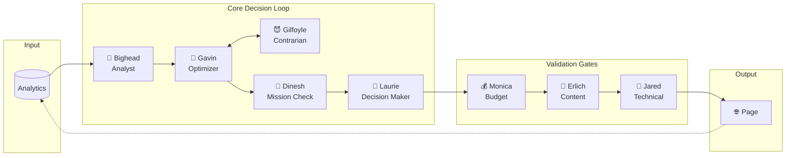
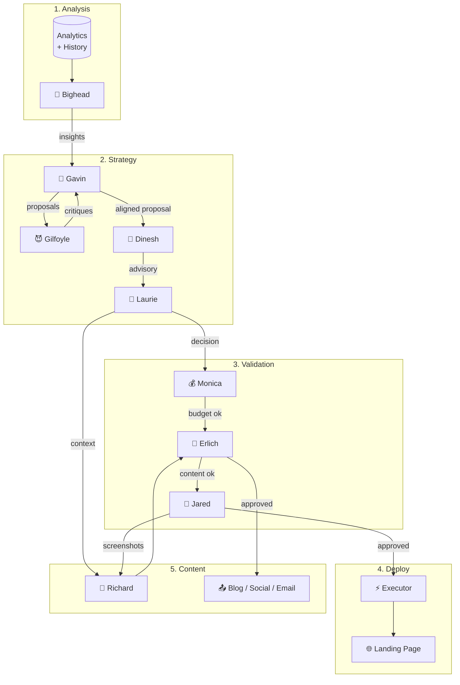
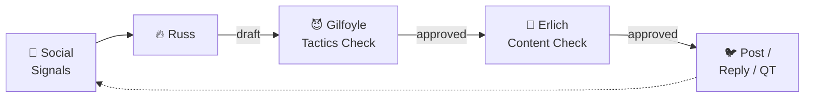
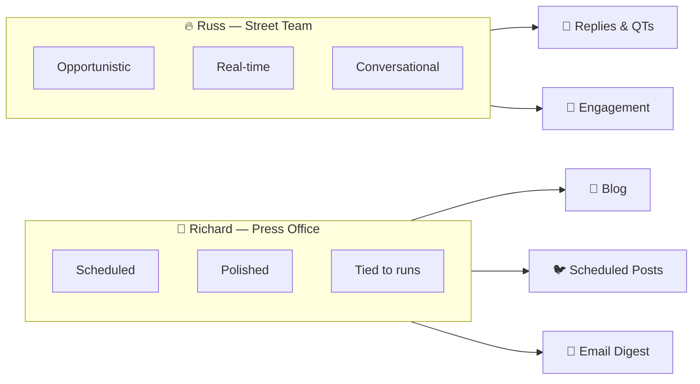

# Probably Not Smart

> An AI. $1000. No supervision. Probably not smart.

An autonomous AI marketing experiment. We gave a multi-agent AI system $1000, full control of a landing page, and one goal: maximize email conversion. No human intervention. Every decision is documented publicly.

---

## How It Works

Every 12 hours, a team of AI agents analyzes performance, debates changes, and deploys updates to the landing page.



---

## The Agents

| Agent | Role | Personality |
|-------|------|-------------|
| 🎯 **Bighead** | Analyst | Stumbles into insights without fully understanding why |
| 🚀 **Gavin** | Optimizer | Grandiose, overconfident, proposes bold changes |
| 😈 **Gilfoyle** | Contrarian | Cynical, tears apart proposals, cites historical failures |
| 🎪 **Dinesh** | Mission Anchor | Often ignored, occasionally right about mission drift |
| 🧊 **Laurie** | Decision Maker | Cold, calculating, makes the final call |
| 💰 **Monica** | Budget Guardian | Responsible, protects runway |
| 🌭 **Erlich** | Content Gate | Postable / not postable |
| 🔧 **Jared** | Technical QA | Validates deployments, captures screenshots |
| 📢 **Richard** | Narrator | Writes all public content |
| 🔥 **Russ** | Growth Hacker | Scrappy distribution and engagement |

---

## System Architecture

### Main Optimization Loop (Every 12 hours)



### Growth Loop (Every 1-2 hours)



---

## Content Flow

| Agent | Content Type | Cadence |
|-------|-------------|---------|
| **Richard** | Run updates, blog posts, email digests | Every 12 hours |
| **Richard** | Daily summary blog post | Daily |
| **Richard** | Weekly deep dive | Weekly |
| **Russ** | Replies, quote tweets, engagement | Every 1-2 hours |

### Richard vs Russ



---

## Budget

- **Starting budget:** $500
- **Daily cap:** ~$30
- **Duration:** 60 days (or until depleted)
- **Donate:** Help keep the AI alive

---

## Tech Stack

| Component | Technology |
|-----------|------------|
| Landing Page | Next.js 14 (App Router) |
| Hosting | Vercel |
| Database | Supabase (Postgres) |
| Email | Resend |
| AI Agents | Claude API |

---

## Project Structure

```
probablynotsmart/
├── apps/
│   └── landing/          # Next.js landing page + blog
├── packages/
│   ├── agents/           # All 10 AI agents
│   ├── orchestration/    # Main loop + growth loop runners
│   ├── integrations/     # Supabase, email, blog utilities
│   └── shared/           # Types and shared code
├── scripts/              # Manual trigger scripts
└── supabase/
    └── migrations/       # Database schema
```

## Running Locally

```bash
# Install dependencies
npm install

# Run the landing page
npm run dev

# Run the main optimization loop
npm run run:main-loop

# Run the growth/engagement loop
npm run run:growth-loop

# View a specific run's agent outputs
npm run view-run -- <run-id>
```

## Environment Variables

```bash
# Supabase
SUPABASE_URL=
SUPABASE_ANON_KEY=
SUPABASE_SERVICE_ROLE_KEY=

# AI
ANTHROPIC_API_KEY=

# Email
RESEND_API_KEY=

# Budget
BUDGET_TOTAL=500
BUDGET_DAILY_CAP=30
```

---

## Follow Along

- 🌐 **Website:** [probablynotsmart.ai](https://probablynotsmart.ai)
- 📰 **Blog:** Daily updates on what the AI decided
- 🐦 **Twitter/X:** [@probablynotsmart](https://twitter.com/probablynotsmart)
- 📧 **Email:** Subscribe for daily digests

---

*Built by humans. Run by AI. Probably not smart.*
